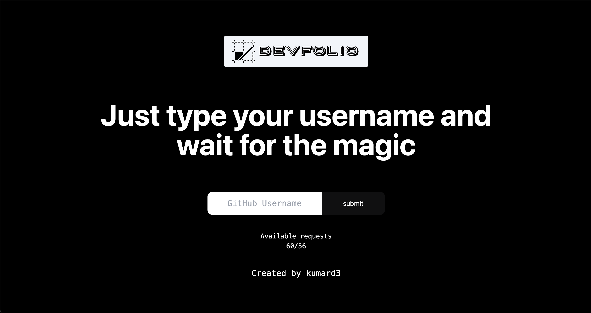

🌐 [Open Website](https://devfolio.kumard3.me)


Devfolio is an open source application which allows developers to create a portfolio in less than 2 minutes with just their **username**.


## Getting Started

First, run the development server:

```bash
npm run dev
# or
yarn dev
```

Open [http://localhost:3000](http://localhost:3000) with your browser to see the result.


Check out Vercel deployment process [Next.js deployment documentation](https://nextjs.org/docs/deployment) for more details.

Built by [Kumar Deepanshu](https://kumard3.me)
